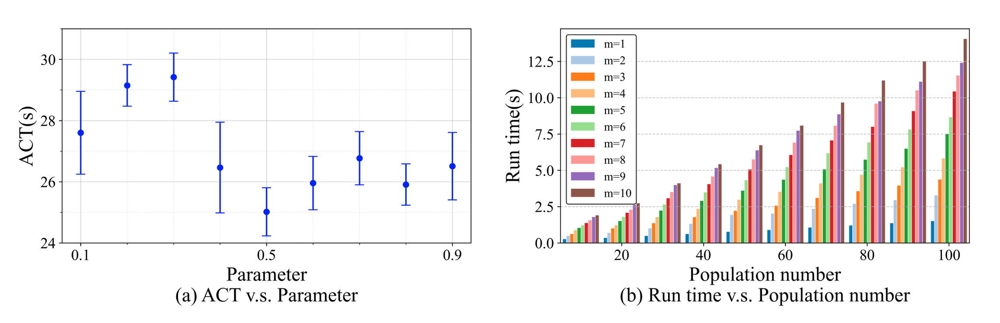
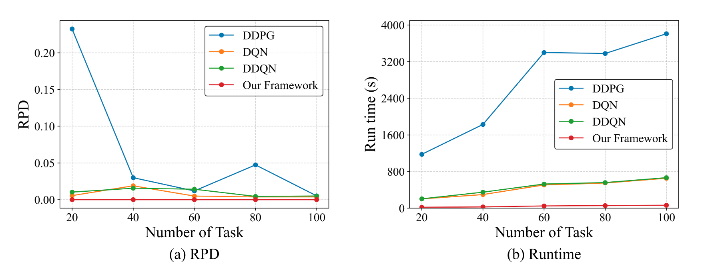

## ISEC
Towards Inference Service with Edge Computing: the Framework and an Improved Firefly Algorithm


## 数据说明
以下是整理后的数据表格，包含参数、取值范围及说明：

| **参数/变量**       | **取值范围/值**       | **说明**                                                                 |
|----------------------|-----------------------|-------------------------------------------------------------------------|
| **DAG结构参数**      |                       |                                                                         |
| 子任务数量（单个推理服务） | [10, 100]            | 每个推理服务的子任务总数随机生成。                                       |
| 子任务出度           | [1, 10]（均匀分布）   | 每个子任务的后继任务数量，模拟窄宽度DAG。                                |
| 子任务计算工作量 $v_i$ | [1, 5]（均匀分布）    | 每个子任务的计算负载。                                                   |
| **边缘服务器（ES）参数** |                       |                                                                         |
| ES数量               | 10                   | 固定为10个边缘服务器。                                                   |
| ES CPU频率 $f_m$   | [4, 8] GHz（均匀分布）| 每个ES的计算能力。                                                       |
| **Firefly算法参数**  |                       |                                                                         |
| 吸引力参数 $beta$ | 0.5（最优值）         | 通过实验确定，范围需在[0, 1]以保证收敛。                                 |
| 最大迭代次数         | 500                  | 算法终止条件。                                                           |
| 萤火虫位置范围       | [-2, 2]（每维度）     | 萤火虫在搜索空间中的初始位置范围。                                       |
| 种群数量 $m$       | 1或10                | 实验中使用1或10个种群。                                                  |
| **实验配置**         |                       |                                                                         |
| 随机实验次数         | 1000（图4-6）/ 20（图7） | 不同数据点的重复实验次数。                                               |
| 推理服务数量 $T$   | 20（默认）           | 对比实验中的推理服务数量。                                               |
| **性能指标**         |                       |                                                                         |
| 平均完成时间（ACT）  | -                    | 子任务调度的核心优化目标。                                               |
| 近似比（AR）         | -                    | 算法解与最优解（SMT求解器）的比值。                                      |
| 完成率（CR）         | -                    | 在截止时间前完成的任务比例。                                             |
| 相对百分比偏差（RPD）| -                    | 评估算法随机性的稳定性指标。                                             |
| **基准对比方案**     |                       |                                                                         |
| DROV                | -                    | 基于欧氏距离更新 + ROV映射。                                            |
| LROV                | -                    | 线性位置更新 + ROV映射。                                                |
| DPM                 | -                    | 欧氏距离更新 + 概率映射。                                               |
| DDPG/DQN/DDQN       | -                    | 基于深度强化学习的对比方案。                                             |

### 补充说明：
1. **图4(a)**：$\beta=0.5$时ACT最低，因此后续实验固定此值。  
2. **图4(b)**：当子任务总数=1000（50子任务×20服务），种群数$m=1$时，运行时间<700ms。  
3. **截止时间计算**（公式26）：  
   - $Deadline = \frac{Len(G)}{f_{avg}} + \frac{Vol(G) \cdot Len(G)}{M \cdot f_{avg}}$  
   - 紧/中/松截止时间分别为0.4×、0.6×、0.4×计算值。  
4. **数据规模**：  
   - 子任务数据大小$d(v_i)$：[0.5, 4] MB（真实应用实验）。  
   - CPU周期需求：[200, 1000] cycles/bit。  
   - ES传输速率：[10, 20] Mbps。  

此表格涵盖了原文中所有关键参数及实验配置，便于快速查阅对比。

## Quick Start 🚀  
#### 1. 克隆仓库到本地
```bash
git clone https://github.com/snowy2002/ISEC.git
cd ISEC
```

#### 2. 创建conda环境
```bash
conda create -n ISEC python=3.7
conda env list
conda activate ISEC
```
#### 3. 安装依赖库
```bash
pip install -r requirements.txt
```

#### 4. 数据生成
在 `ISEC$` 目录下，运行 `data_generate.py` 进行数据生成
```bash
python code/data_generate.py
```

#### 5. 模型训练
在 `ISEC$` 目录下，运行 `train.py` 进行模型训练
```bash
python code/train.py
```

## 测试结果
#### 不同参数对我们框架性能的影响


#### 与基线FA的收敛性对比 


#### ACT与AR的性能对比


#### ACT和CR的性能对比


#### RPD 与 Runtime 的性能对比
